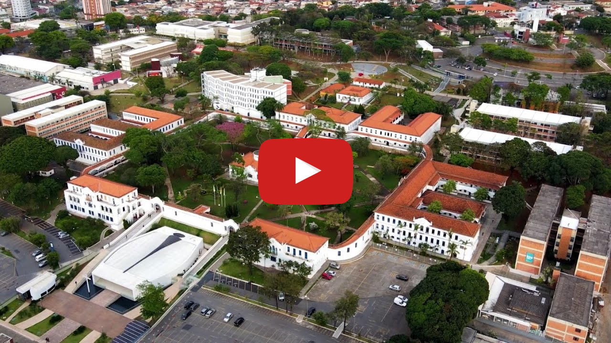

# CARD - Heart Rate Monitor

Nos dias atuais, observamos um aumento significativo nas doenças cardíacas, com um risco crescente de ataques cardíacos. Para abordar essa preocupação, propomos um sistema inovador que utiliza sensores para detectar a frequência cardíaca de uma pessoa, mesmo enquanto ela está em casa. Esses sensores são conectados a um microcontrolador que permite a verificação das leituras da frequência cardíaca e sua transmissão pela internet.

## Alunos integrantes da equipe

* [Ana Beatriz Santos de Oliveira](https://github.com/Ana-Bea-S)
* [Bárbara Maria Sampaio Portes](https://github.com/bmsampaio)
* [Eron Arthur da Silva](https://github.com/SrEron)
* [Rodrigo Albuquerque Rocha](https://github.com/Rodrigo-ARocha)

## Professor responsável

* [Felipe Augusto Lima Reis](https://github.com/falreis)

## Gerenciamento do Projeto

......  COLOQUE AQUI O SEU TEXTO (OPCIONAL) ......

> Adicione aqui informações sobre o projeto que será gerenciado. 
> Indique informações importantes sobre o projeto.

Fases do Gerenciamento do Projeto:
1. [Iniciação](docs/01-iniciacao)
2. [Planejamento](docs/02-planejamento)
3. [Execução](docs/03-execucao)
4. [Monitoramento](docs/04-monitoramento)
5. [Encerramento](docs/05-encerramento)

## Apresentação do Trabalho

......  COLOQUE AQUI O SEU TEXTO ......

> Adicione aqui o vídeo explicativo do trabalho.
> Utilize a estrutura (link) abaixo para apresentação do vídeo.
> O vídeo deve ser postado obrigatoriamente de forma pública no Youtube ou qualquer outra plataforma 

> A imagem abaixo deve ser substituída por uma capa do vídeo de apresentação do trabalho.

## Informações Adicionais

......  COLOQUE AQUI O SEU TEXTO ......

> Inclua aqui informações extra sobre o projeto.
> Caso não existam informações extras, remova a seção.
