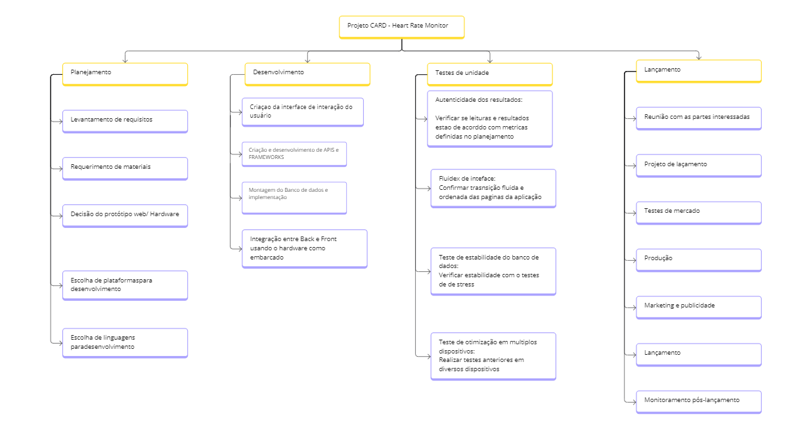
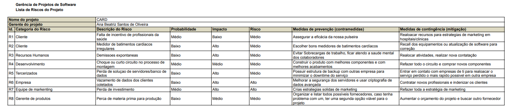

# Planejamento

> A fase de planejamento na gerência de projetos é um momento onde os detalhes do projeto são minuciosamente definidos para garantir uma execução bem-sucedida. 
> Durante essa etapa, os gerentes de projeto e suas equipes elaboram um plano abrangente que aborda aspectos como cronograma, orçamento, recursos necessários, riscos identificados e métodos de controle. 
> O objetivo é criar uma estrutura que guiará as atividades ao longo do projeto, garantindo que metas sejam alcançadas de maneira eficiente. 
> O plano de projeto não apenas define as tarefas específicas e suas interdependências, mas também estabelece critérios de sucesso e indicadores de desempenho. 
> A qualidade do planejamento influencia diretamente a capacidade da equipe em cumprir prazos, alocar recursos eficientemente e lidar com desafios que possam surgir durante a execução.

# Estrutura do Documento

- [Fase de Planejamento](#planejamento)
- [Estrutura Analítica do Projeto](#estrutura-analítica-do-projeto)
- [Matriz de Responsabilidades](#matriz-de-responsabilidades)
- [Escopo do Projeto](#escopo-do-projeto)
- [Cronograma do Projeto](#cronograma-do-projeto)
- [Orçamento do Projeto](#orçamento-do-projeto)
- [Planos de Gerenciamento](#planos-de-gerenciamento)
  - [Plano de Comunicação](#plano-de-comunicação)
  - [Plano de Qualidade](#plano-de-qualidade)
  - [Plano de Riscos](#plano-de-riscos)
  - [Plano de Aquisição](#plano-de-aquisição)
- [Documentos](#documentos)
  - [Aquisição de Produtos](#aquisição-de-produtos)
  - [Checklist de Qualidade](#checklist-de-qualidade)
  - [Escopo, Cronograma e Orçamento](#escopo-cronograma-e-orçamento)
  - [Estrutura Analítica do Projeto (EAP)](#estrutura-analítica-do-projeto-eap)
  - [Matriz de Responsabilidades (RACI)](#matriz-de-responsabilidades-raci)
  - [Plano de Gerência de Comunicação](#plano-de-gerenciamento-de-comunicação)
  - [Plano de Gerenciamento de Riscos](#plano-de-gerenciamento-de-riscos)

# Estrutura Analítica do Projeto

> 

# Matriz de Responsabilidades

A Matriz de Responsabilidades (matriz RACI) foi desenvolvida com uma distribuição igualitária e funcional em mente. Ana Beatriz assumiu o papel de Gerente do Projeto, uma escolha lógica, considerando que ela já era Scrum Master. A divisão foi feita em 16 atividades, cada uma com uma distinção clara. Foi dado ao patrocinador o trabalho de aprovar cada uma dessas atividades. Ao gerente e à equipe, foi atribuído o papel de serem informados ou consultados, enquanto outra parte era responsável.

# Escopo do Projeto

No escopo do projeto, foram listadas as etapas estimadas para a conclusão, sendo elas: 1) planejamento, 2) análise de requisitos, 3) design do sistema, 4) desenvolvimento, 5) teste e validação, 6) implementação, 7) distribuição, e 8) manutenção e suporte. Foram definidas as restrições e os limites, de forma a minimizar a perda de tempo. Por fim, foram estabelecidas as condições para iniciar o projeto e as etapas foram divididas em datas de entrega.

# Cronograma do Projeto
Feito no software ProjectLibre, o cronograma foi dividido em três principais etapas: 1) levantamento de requisitos, 2) desenvolvimento e 3) implantação, com prazo estimado de 95 dias, sendo 30, 60 e 35 dias, respectivamente. Dentro dessas três etapas principais, foram criadas cerca de cinco subetapas, que dividem entre si, conforme a importância, o tempo de cada etapa.

# Orçamento do Projeto

Feito no software ProjectLibre, o orçamento foi dividido em quatro etapas: 1) iniciação, 2) planejamento, 3) execução e 4) encerramento. Cada etapa teve um prazo atribuído e foi subdividida em 6 a 7 subetapas. Nessas subetapas, foram definidos os prazos, atribuídos os responsáveis e vinculados os valores necessários para a realização de cada atividade. Ao final, foi feita a estimativa de custo por hora de cada integrante.

# Planos de Gerenciamento

## Plano de Comunicação

O plano de comunicação foi composto por reuniões diárias, semanais e quinzenais previamente agendadas, além de reuniões emergenciais que ocorrem sempre que há mudanças significativas no projeto ou após a conclusão de grandes tarefas. Os principais meios utilizados para as reuniões foram Microsoft Teams e GitHub, com o uso de grupos no WhatsApp como canal de distribuição de informações.

## Plano de Qualidade

O plano de qualidade foi elaborado por meio da listagem de diversas atividades que precisam passar por testes e aperfeiçoamentos antes da implementação. Após estabelecer as atividades, foi designado um responsável para garantir o bom funcionamento de cada uma até a data limite. Além disso, foram definidas as métricas pelas quais cada atividade será avaliada, bem como os fatores que levariam à não conformidade. Ao final, foi também atribuída outra pessoa para realizar a avaliação. Foi listada a norma utilizada para a avaliação e uma lista generalizada indicando o que cada integrante está avaliando.

## Plano de Riscos

> 

## Plano de Aquisição

O plano de aquisição abrange desde itens físicos para protótipos até licenças de softwares utilizados no desenvolvimento. Cada item listado inclui a quantidade necessária e uma justificativa para sua escolha. Os produtos físicos, em específico, possuem uma quantidade destinada à prototipagem e outra para a distribuição final.
# Documentos

## Aquisição de Produtos

> Você deve preencher o seguinte documento:
- [Aquisição de Produtos](artefatos/solicitacao-compra.pdf)

## Checklist de Qualidade

> Você deve preencher o seguinte documento:
- [Checklist de Qualidade](artefatos/checklist_qualidade.pdf)

## Escopo, Cronograma e Orçamento

> Você deve preencher o seguinte documento:
- [Declaracao_escopo](artefatos/Declaracao_escopo.pdf)
- [cronograma](artefatos/cronograma.pod)
- - [cronograma](artefatos/Orçamento.pod)

## Estrutura Analítica do Projeto (EAP)

> Você deve preencher o seguinte documento:
- [Estrutura Analítica do Projeto](artefatos/EAP.png)

## Matriz de Responsabilidades (RACI)

> Você deve preencher o seguinte documento:
- [Matriz de Responsabilidades (RACI)](artefatos/matriz-RACI.pdf)

## Plano de Gerenciamento de Comunicação

> Você deve preencher o seguinte documento:
- [Plano de Gerenciamento de Comunicação](artefatos/plano_comunicacao.pdf)

## Plano de Gerenciamento de Riscos

> Você deve preencher o seguinte documento:
- [Plano de Gerenciamento de Riscos](artefatos/plano_riscos.pdf)
