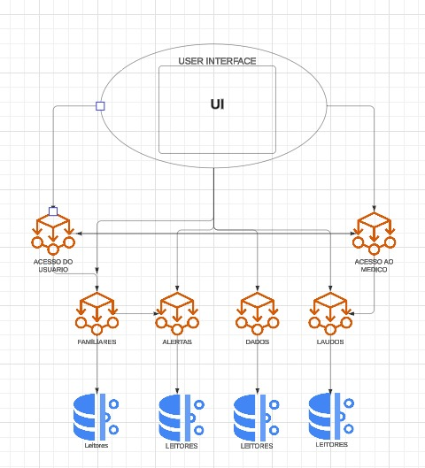
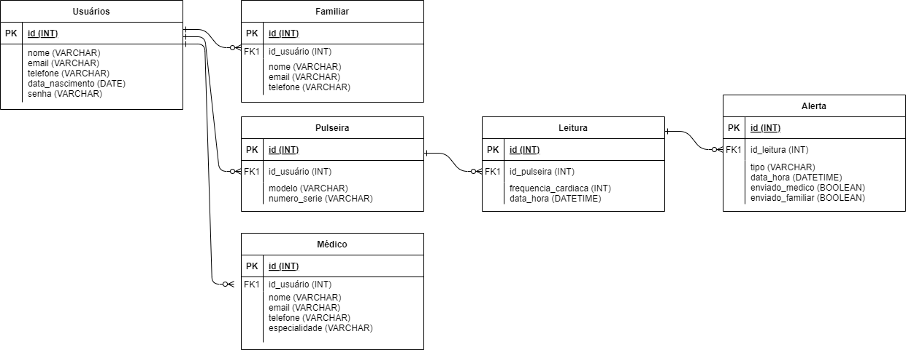

# Execução

> A fase de execução na gerência de projetos é o momento em que as atividades planejadas são realizadas. 
> Durante essa etapa, os membros da equipe executam suas tarefas de acordo com o cronograma estabelecido, os recursos são alocados conforme as necessidades e as comunicações são fundamentais para garantir que todos estejam alinhados com os objetivos. 
> O gerente de projeto atua na coordenação das atividades, resolução de problemas e na gestão de mudanças inesperadas. 
> Além disso, o monitoramento constante é essencial para garantir que o projeto esteja avançando conforme o planejado, e ajustes são feitos conforme necessário. 
> A fase de execução é o momento em que o trabalho tangível é realizado, e a eficácia nessa etapa contribui diretamente para o sucesso geral do projeto.

```diff
- Esta seção irá simular a execução do projeto. 
- Devido às características da disciplina, não será possível implementar o software (tempo insuficiente).
- Com isso, apenas simularemos a construção do sistema nesta etapa.
- Para isso, serão criados protótipos navegáveis, representando aquilo que seria desenvolvido em termos de interface.
- Diagramas arquiteturais, de banco de dados e de classe representarão a modelagem e implementação do código-fonte.
```

# Estrutura do Documento

- [Fase de Execução](#execução)
- [Interfaces do Sistema](#interfaces-do-sistema)
- [Modelagem da Solução](#modelagem-da-solução)
  - [Arquitetura da Solução](#arquitetura-da-solução)
  - [Diagrama de Classes](#diagrama-de-classes)
  - [Persistência dos Dados](#persistência-dos-dados)


# Interfaces do Sistema

......  INCLUA AQUI O DIAGRAMA COM O FLUXO DO USUÁRIO NA APLICAÇÃO ......

> Os protótipos navegáveis oferecem uma representação interativa das interfaces e funcionalidades do sistema antes da implementação final. 
> Esses protótipos permitem que os usuários experimentem a navegação real entre telas e interajam com elementos de interface, proporcionando uma visão prática do design proposto. 
> Ao criar protótipos navegáveis, os desenvolvedores podem validar conceitos, testar a usabilidade e obter feedback de stakeholders e usuários finais. 
> Essa abordagem contribui para a detecção precoce de possíveis problemas de usabilidade, refinando o design e economizando tempo e recursos durante o ciclo de desenvolvimento. 
>
> **Links Úteis**:
> - [User Flow: O Quê É e Como Fazer?](https://medium.com/7bits/fluxo-de-usu%C3%A1rio-user-flow-o-que-%C3%A9-como-fazer-79d965872534)
> - [User Flow vs Site Maps](http://designr.com.br/sitemap-e-user-flow-quais-as-diferencas-e-quando-usar-cada-um/)
> - [Top 25 User Flow Tools & Templates for Smooth](https://www.mockplus.com/blog/post/user-flow-tools)
>
> **Exemplo**:
> 
> 

# Modelagem da Solução

> A modelagem de soluções desempenha um papel crucial no desenvolvimento da pulseira de monitoramento cardíaco, fornecendo uma base sólida para o design e a implementação do sistema.
> Através da criação de representações abstratas, a modelagem nos permite visualizar e analisar diferentes aspectos do sistema, garantindo que ele atenda aos requisitos funcionais e não funcionais.
>
> A modelagem de soluções oferece diversos benefícios para o projeto da pulseira de monitoramento cardíaco:
> Redução de Erros: A modelagem permite identificar inconsistências e erros de lógica no design do sistema antes da implementação, economizando tempo e recursos em correções posteriores.
> Comunicação Eficaz: Os modelos criados servem como uma linguagem comum entre desenvolvedores, analistas e stakeholders, facilitando a comunicação e o alinhamento de expectativas.
> Documentação Técnica: A modelagem gera documentação técnica valiosa, facilitando a compreensão do sistema por novos membros da equipe ou durante a manutenção.
> Evolução do Sistema: Os modelos bem projetados facilitam a análise do impacto de mudanças e a adaptação do sistema a novas necessidades ao longo do tempo.
> Em resumo, a modelagem de soluções é uma etapa fundamental no processo de desenvolvimento da pulseira de monitoramento cardíaco, contribuindo para a criação de um sistema robusto, eficiente e bem documentado.

## Arquitetura da solução

> A arquitetura de microsserviços decompõe a aplicação em serviços menores e independentes, cada um com uma responsabilidade específica. Esses serviços se comunicam entre si através de > APIs bem definidas.
> Serviços:
> Serviço de Monitoramento: Responsável por receber e processar os dados de frequência cardíaca da pulseira.
>
> Serviço de Alertas: Responsável por analisar os dados, identificar irregularidades e disparar alertas.
>
> Serviço de Usuários: Responsável por gerenciar os usuários, seus perfis e configurações.
>
> Serviço de Comunicação: Responsável por enviar alertas para médicos e familiares (através de SMS, email, etc.).
>
> Serviço de Autenticação: Responsável por autenticar usuários e garantir o acesso seguro aos dados.
>
> Banco de Dados: Cada microsserviço pode ter seu próprio banco de dados para armazenar os dados específicos de sua responsabilidade.
> 
> 


## Diagrama de Classes

......  COLOQUE AQUI O SEU TEXTO E O DIAGRAMA DE CLASSES .......

> O diagrama de classes fornece uma representação visual das estruturas e relações entre as classes em um sistema orientado a objetos. 
> O diagrama serve como uma documentação visual eficaz, facilitando a compreensão, manutenção e contínua do software.
>
> **Diagrama de Classes:**
> Desenvolva um diagrama de classes para o sistema proposto.
> Caso a solução fique muito grande, divida o diagrama por módulos ou serviços.
> Explique de forma concisa o diagrama, para que seja possível entender a solução proposta.
>
> **Exemplo de diagrama de Classes**:
> 


## Persistência dos Dados

> **Banco de Dados Relacional:**
> MySQL: Banco de dados relacional de código aberto, amplamente utilizado e com boa documentação.
>
> **Banco de Dados No-SQL:**
> MongoDB: Banco de dados orientado a documentos, flexível e escalável
> 
> **Diagrama de Banco de Dados:**
>
> O diagrama de banco de dados proposto visa organizar os dados da pulseira de monitoramento cardíaco de forma eficiente e segura. Aqui está uma explicação concisa:
>
> Entidades: O diagrama apresenta entidades como Usuários, Médicos, Familiares, Pulseiras, Leituras e Alertas. Cada entidade representa um tipo de informação a ser armazenada.
> 
> Atributos: Cada entidade possui atributos (campos) que definem suas características. Por exemplo, a entidade Usuário possui atributos como nome, email e data de nascimento.
> 
> Relacionamentos: As linhas entre as entidades representam os relacionamentos entre elas. Por exemplo, um usuário pode ter várias pulseiras (relacionamento 1:N).
> 
> Chaves Estrangeiras: As chaves estrangeiras (como id_usuario na tabela Pulseiras) estabelecem conexões entre tabelas, garantindo a integridade dos dados.
> 
> Tipos de Dados: Cada atributo possui um tipo de dado definido (INT, VARCHAR, DATE, etc.), garantindo a consistência e otimizando o armazenamento.
>
> 


