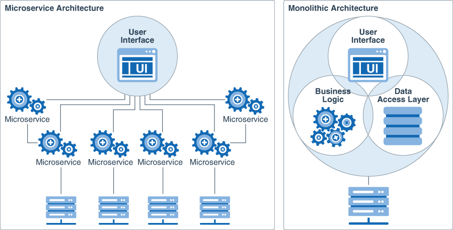
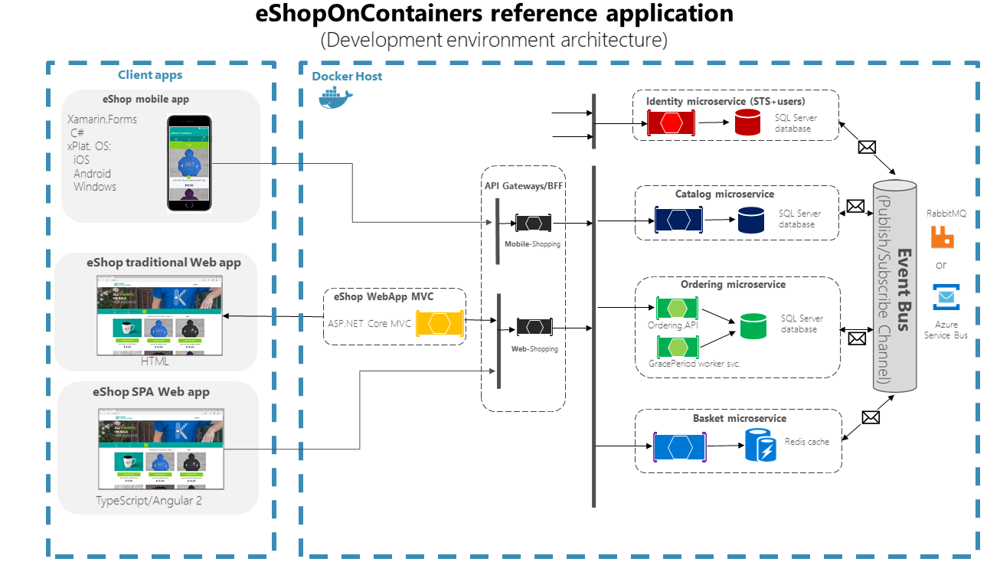
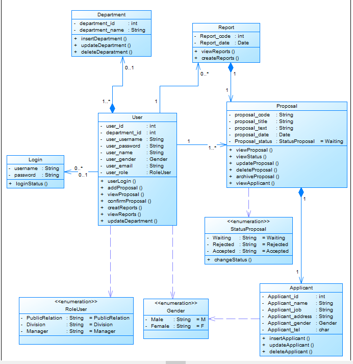

# Execução

> A fase de execução na gerência de projetos é o momento em que as atividades planejadas são realizadas. 
> Durante essa etapa, os membros da equipe executam suas tarefas de acordo com o cronograma estabelecido, os recursos são alocados conforme as necessidades e as comunicações são fundamentais para garantir que todos estejam alinhados com os objetivos. 
> O gerente de projeto atua na coordenação das atividades, resolução de problemas e na gestão de mudanças inesperadas. 
> Além disso, o monitoramento constante é essencial para garantir que o projeto esteja avançando conforme o planejado, e ajustes são feitos conforme necessário. 
> A fase de execução é o momento em que o trabalho tangível é realizado, e a eficácia nessa etapa contribui diretamente para o sucesso geral do projeto.

```diff
- Esta seção irá simular a execução do projeto. 
- Devido às características da disciplina, não será possível implementar o software (tempo insuficiente).
- Com isso, apenas simularemos a construção do sistema nesta etapa.
- Para isso, serão criados protótipos navegáveis, representando aquilo que seria desenvolvido em termos de interface.
- Diagramas arquiteturais, de banco de dados e de classe representarão a modelagem e implementação do código-fonte.
```

# Estrutura do Documento

- [Fase de Execução](#execução)
- [Interfaces do Sistema](#interfaces-do-sistema)
- [Modelagem da Solução](#modelagem-da-solução)
  - [Arquitetura da Solução](#arquitetura-da-solução)
  - [Diagrama de Classes](#diagrama-de-classes)
  - [Persistência dos Dados](#persistência-dos-dados)


# Interfaces do Sistema

......  INCLUA AQUI O DIAGRAMA COM O FLUXO DO USUÁRIO NA APLICAÇÃO ......

> Os protótipos navegáveis oferecem uma representação interativa das interfaces e funcionalidades do sistema antes da implementação final. 
> Esses protótipos permitem que os usuários experimentem a navegação real entre telas e interajam com elementos de interface, proporcionando uma visão prática do design proposto. 
> Ao criar protótipos navegáveis, os desenvolvedores podem validar conceitos, testar a usabilidade e obter feedback de stakeholders e usuários finais. 
> Essa abordagem contribui para a detecção precoce de possíveis problemas de usabilidade, refinando o design e economizando tempo e recursos durante o ciclo de desenvolvimento. 
>
> **Links Úteis**:
> - [User Flow: O Quê É e Como Fazer?](https://medium.com/7bits/fluxo-de-usu%C3%A1rio-user-flow-o-que-%C3%A9-como-fazer-79d965872534)
> - [User Flow vs Site Maps](http://designr.com.br/sitemap-e-user-flow-quais-as-diferencas-e-quando-usar-cada-um/)
> - [Top 25 User Flow Tools & Templates for Smooth](https://www.mockplus.com/blog/post/user-flow-tools)
>
> **Exemplo**:
> 
> 

# Modelagem da Solução

......  COLOQUE AQUI O SEU TEXTO ......


> A modelagem de software envolve a criação de representações abstratas que capturam a estrutura, comportamento e interações do software a ser desenvolvido. 
> Esses modelos servem como guias visuais que auxiliam na compreensão e comunicação entre os membros da equipe de desenvolvimento. 
> A modelagem de software abrange diversas técnicas, como diagramas de classes, diagramas de sequência e diagramas de caso de uso, proporcionando uma representação visual clara das relações e funcionalidades do sistema. 
> Essa abordagem facilita a identificação precoce de requisitos e a detecção de inconsistências. 
> Além disso, a modelagem contribui para a documentação eficaz, permitindo uma compreensão mais abrangente do software antes mesmo de sua implementação. 


## Arquitetura da solução

......  COLOQUE AQUI O SEU TEXTO E O DIAGRAMA DE ARQUITETURA .......

> A arquitetura de software define a organização de um sistema, definindo seus componentes e suas relações.
> Abrange escolhas de design que influenciam aspectos como desempenho, escalabilidade, segurança e manutenibilidade do software. 
> A arquitetura de software serve como um mapa que orienta as decisões de desenvolvimento, fornecendo uma visão global que facilita a compreensão e a colaboração entre membros da equipe. 
> Uma arquitetura bem projetada promove a modularidade, facilitando a evolução e a manutenção do sistema ao longo do tempo.

> Inclua um diagrama da arquitetura do sistema. 
> Explique e justifique a arquitetura escolhida, com base nos objetivos do sistema, número de usuários esperados, tamanho da aplicação, previsão de expansão do sistema e orçamento do projeto.
> 
> **Exemplo do diagrama de Arquitetura (Microserviços x Monolítica)**:
> 
>
> **[Exemplo Arquitetura eShopOnContainers](https://learn.microsoft.com/pt-br/dotnet/architecture/microservices/multi-container-microservice-net-applications/microservice-application-design)**
> 


## Diagrama de Classes

......  COLOQUE AQUI O SEU TEXTO E O DIAGRAMA DE CLASSES .......

> O diagrama de classes fornece uma representação visual das estruturas e relações entre as classes em um sistema orientado a objetos. 
> O diagrama serve como uma documentação visual eficaz, facilitando a compreensão, manutenção e contínua do software.
>
> **Diagrama de Classes:**
> Desenvolva um diagrama de classes para o sistema proposto.
> Caso a solução fique muito grande, divida o diagrama por módulos ou serviços.
> Explique de forma concisa o diagrama, para que seja possível entender a solução proposta.
>
> **Exemplo de diagrama de Classes**:
> 


## Persistência dos Dados

......  COLOQUE AQUI O SEU TEXTO E O MODELOS DE DADOS .......

> **Banco de Dados Relacional:**
> Um diagrama relacional é uma representação gráfica que ilustra as tabelas e as relações entre elas em um banco de dados relacional. 
> Ele descreve a estrutura do banco de dados, destacando as entidades, seus atributos e as conexões estabelecidas.
>
> **Banco de Dados No-SQL:**
> Bancos de dados NoSQL representam uma categoria diversificada de sistemas de gerenciamento de dados que se afastam do modelo relacional tradicional. 
> Ao contrário dos bancos de dados SQL, os NoSQL adotam abordagens mais flexíveis e escaláveis para armazenar e recuperar dados. 
> Esses sistemas são particularmente eficazes em lidar com grandes volumes de dados não estruturados ou semiestruturados, como documentos, grafos, pares chave-valor e famílias de colunas.
> 
> **Diagrama de Banco de Dados:**
> Desenvolva um diagrama de banco de dados para o sistema proposto.
> Indique como as informações serão persistitdas, incluindo nome do banco de dados (ou base de dados) e uso de frameworks de persistências, caso utilizados.
> Explique de forma concisa o diagrama, para que seja possível entender a solução proposta.
>
> **Exemplo de diagrama de Banco de Dados**:
> 


