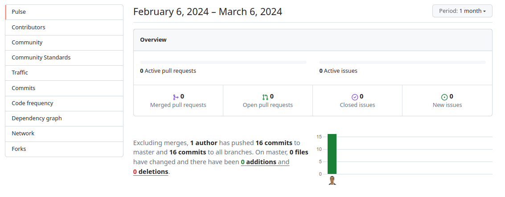
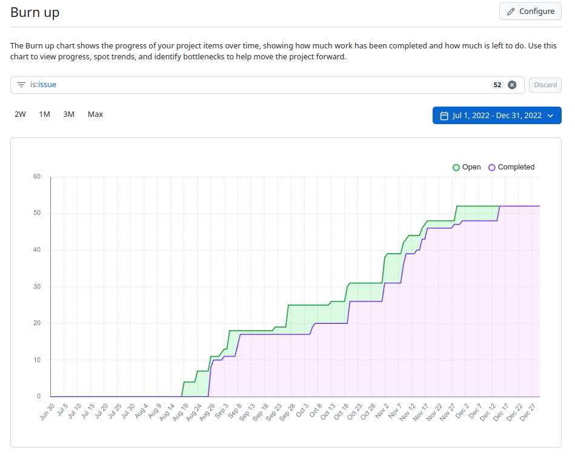
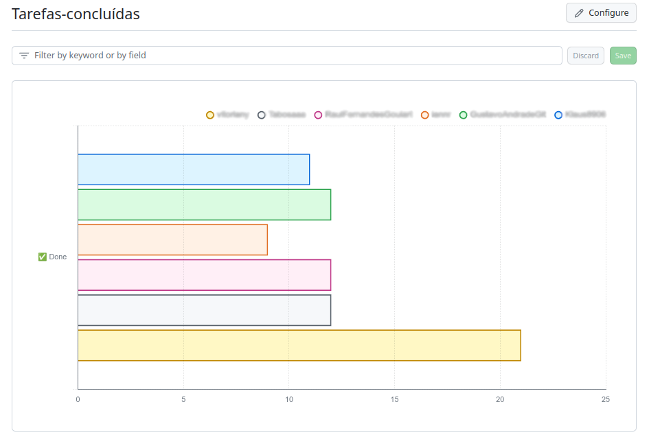

# Monitoramento

> A fase de monitoramento busca avaliar o progresso, identificar desvios em relação ao plano e garantir que as metas sejam alcançadas de maneira eficiente. 
> Durante esta etapa, que ocorre paralelamente com outras etapas do projeto, realizam-se análise de desempenho x previsão, comparando os resultados reais com as metas estabelecidas. 
> São implementados sistemas de controle para medir o avanço, identificar potenciais desafios e ajustar estratégias conforme necessário. 
> A fase de monitoramento é dinâmica, exigindo adaptação constante para garantir que o projeto esteja alinhado com as expectativas e que ajustes sejam feitos para manter o curso correto em direção aos objetivos estabelecidos.
> Por fim, a comunicação efetiva é fundamental para manter todas as partes interessadas informadas sobre o status do projeto. 

# Estrutura do Documento

- [Fase de Monitoramento](#monitoramento)
- [Atas de Reunião](#atas-de-reunião)
- [Relatórios de Desempenho](#relatórios-de-desempenho)
  - [Insights do repositório](#insights-do-repositório)
  - [Burn-up do projeto](#burn-up-do-projeto)
  - [Relatório de tarefas concluídas](#relatório-de-tarefas-concluídas)

# Atas de Reunião

......  COLOQUE AQUI O SEU TEXTO ......

> A ata de reunião é responsável por registrar e documentar as discussões, decisões e ações tomadas durante as reuniões do projeto.
> Este instrumento fornece uma narrativa estruturada daquilo que foi abordado na reunião, ajudando a preservar a transparência, a responsabilidade e a memória do grupo. 
> Em uma ata de reunião típica, são registrados tópicos como a lista de participantes, agenda, pontos de discussão, decisões tomadas, ações atribuídas, e prazos acordados. 
> A ata não apenas serve como uma referência histórica, mas também como um meio de comunicação eficaz para aqueles que não puderam participar, garantindo que todos estejam alinhados com os acontecimentos e responsabilidades subsequentes. 
> 
> Para preenchimento das atas de reunião, utilize o seguinte template:
> * [Template de Ata de Reunião](artefatos/template-ata-reuniao.docx)

## Atas de Reunião do Projeto

......  ATUALIZE A LISTA DE ATAS DE REUNIÃO DO PROJETO ......

> Atualize a lista de atas de reunião do projeto, com as atas entregues semanalmente na disciplina.
> Mantenha um padrão de nomenclatura dos arquivos, utilizando as datas como referência.

1. [2024-02-23 - Ata de Reunião](artefatos/ata-reuniao_2024-02-23.pdf)
2. [2024-03-01 - Ata de Reunião](artefatos/ata-reuniao_2024-03-01.pdf)
3. ....

# Relatórios de Desempenho

> Os relatórios de desempenho fornecem uma visão do status e do progresso das atividades do projeto. 
> Esses relatórios são ferramentas fundamentais para comunicar informações relevantes aos stakeholders, permitindo uma avaliação do desempenho em relação aos objetivos estabelecidos. 
> Podem incluir dados sobre custos, prazos, qualidade e outros indicadores-chave, permitindo insights para a tomada de decisões. 
> Além disso, eles facilitam a identificação precoce de possíveis desvios e a implementação de ações corretivas, contribuindo para a gestão proativa de riscos e a maximização da eficiência operacional. 
> A transparência proporcionada pelos relatórios promove a confiança aos stakeholders, melhorando a comunicação

> Inclua nesta seção os relatórios de desempenho fornecidos pelo GitHub Project.
> Os seguintes relatórios devem ser fornecidos:
> * Insights do repositório.
> * Burn-up do projeto.
> * Relatório de tarefas concluídas, por aluno.

## Insights do repositório

......  ATUALIZE AS IMAGENS MENSALMENTE ......

> Os insights do repositório indicam a quantidade de commits realizados, quantidade de tarefas fechadas, problemas levantados no software, entre outras métricas.
> Devem ser fornecidos insights mensais sobre o andamento do projeto (últimos 30 dias).

**Insight - Mês Março**

**Insight - Mês Abril**
> Adicione aqui insights do mês de Abril.

**Insight - Mês Maio**
> Adicione aqui insights do mês de Maio.

**Insight - Mês Junho**
> Adicione aqui insights do mês de Junho.

## Burn-up do projeto

......  ATUALIZE A IMAGEM AO FIM DO PROJETO ......

> No Scrum, o gráfico burn-up é uma ferramenta utilizada para visualizar o progresso acumulado de um time em relação às entregas planejadas ao longo do tempo. 
> Esse gráfico é construído com base em duas linhas principais: a linha de escopo total do projeto (geralmente representada por uma linha reta ascendente) e a linha de trabalho concluído pelo time (geralmente representada por uma linha que se acumula ao longo do tempo). 
> A interseção entre essas duas linhas revela o progresso real do projeto.
> 
> O gráfico burn-up proporciona uma visão do desenvolvimento do projeto, permitindo que as equipes e os stakeholders acompanhem de perto o trabalho concluído em comparação com as metas estabelecidas. 
> Se a linha de trabalho concluído se mantém abaixo da linha de escopo total, pode indicar que o projeto está atrasado.
> Por outro lado, se a linha de trabalho concluído se mantém acima da linha de escopo total, isto pode indicar que o projeto está adiantado em relação ao planejado.

## Relatório de tarefas concluídas

......  ATUALIZE A IMAGEM AO FIM DO PROJETO ......

> O relatório de tarefas concluídas por pessoa é oferece uma visão do desempenho individual dos membros da equipe em relação às atividades atribuídas durante um sprint ou durante o projeto. 
> Ao detalhar as tarefas concluídas por cada membro da equipe, o relatório permite uma análise mais precisa da distribuição de carga de trabalho, participação na realização das mesmas, identificação de possíveis gargalos ou pessoas que não estão contribuindo de forma adequada.
> Este relatório poderá ser utilizado para definição de notas individuais aos alunos, diferentes daquelas definidas para o grupo.

